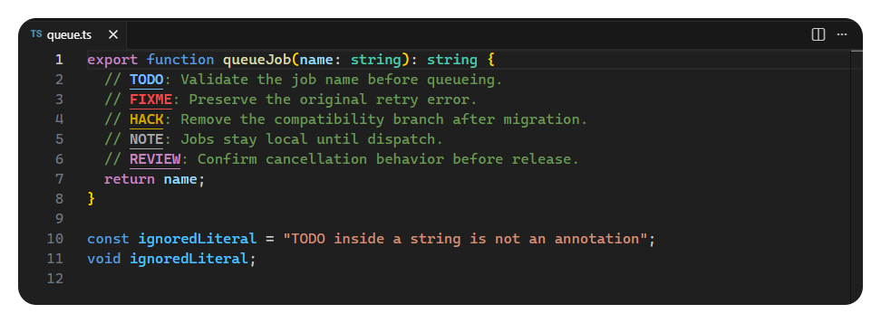

<div align="center">
  <a href="https://github.com/gvastethecreator/vscode-code-annotations"></a>

# Code Annotations: TODO Index

**Find, highlight, and navigate comment markers without leaving VS Code.**

<p align="center">
  <a href="https://github.com/gvastethecreator/vscode-code-annotations"></a>
  <a href="LICENSE"></a>
  <a href="https://github.com/gvastethecreator/vscode-code-annotations/actions/workflows/ci.yml"></a>
</p>
</div>

---

Code Annotations decorates `TODO`, `FIXME`, `HACK`, `NOTE`, `REVIEW`, and `DEPRECATED` inside comments. Its native Explorer view builds a bounded workspace index only when you open the view or run a workspace command.



## Features

- Comment-aware matching for common slash, hash, markup, stylesheet, Markdown, and MDX comment forms.
- Theme-aware token-only decorations; no full-line paint and no color-only meaning.
- Native Explorer Tree View grouped by file, with line numbers, counts, and accessible labels.
- Next and previous navigation with wraparound.
- Native multi-select Quick Pick filtering.
- Literal custom tokens only: no regular expressions, evaluated code, or workspace scripts.
- Lazy, cancellable, URI-safe scanning with open-document authority and incremental file updates.
- Desktop, web, virtual, remote, and Restricted Mode support.

## Use

1. Open a file containing a supported comment marker.
2. Expand **Code Annotations** in Explorer, or run **Code Annotations: Show All**.
3. Select an item to reveal its exact token. Use **Next Annotation** and **Previous Annotation** to move through the filtered index.

## Commands

| Command | Result |
| --- | --- |
| `Code Annotations: Refresh Workspace` | Rebuild the bounded workspace index. |
| `Code Annotations: Show All` | Clear the filter, scan if needed, and focus the view. |
| `Code Annotations: Filter Tokens...` | Choose visible tokens with a native Quick Pick. |
| `Code Annotations: Clear Filter` | Restore every configured token. |
| `Code Annotations: Next Annotation` | Open the next filtered result, wrapping at the end. |
| `Code Annotations: Previous Annotation` | Open the previous filtered result, wrapping at the start. |

No default keybindings are installed.

## Settings

| Setting | Default | Purpose |
| --- | --- | --- |
| `codeAnnotations.enabled` | `true` | Enable decorations and workspace features. |
| `codeAnnotations.tokens` | Six built-in markers | Set up to 32 literal, whitespace-free tokens. |
| `codeAnnotations.caseSensitive` | `true` | Require exact token case. |
| `codeAnnotations.decorations.enabled` | `true` | Show token decorations in visible editors. |
| `codeAnnotations.scan.include` | `["**/*"]` | Include workspace paths. |
| `codeAnnotations.scan.exclude` | Generated/vendor defaults | Exclude paths from the index. |
| `codeAnnotations.scan.maxFileSize` | `1048576` | Skip files larger than 1 MiB. |
| `codeAnnotations.scan.maxFiles` | `20000` | Bound candidates per full scan. |
| `codeAnnotations.scan.maxResults` | `10000` | Bound retained workspace results. |

Each file is also capped at 1,000 results. Annotation messages are capped at 500 characters. The view reports when any limit, cancellation, or read error makes the index partial.

## Matching notes

The scanner recognizes common language comment forms and ignores ordinary strings in supported adapters. Markdown and MDX scan HTML comments outside fenced code. Unknown languages use a conservative line-prefix fallback. Embedded or unusual language grammars can still require a manual refresh or a future adapter; this release intentionally avoids a universal parser.

## Privacy and trust

All scanning stays inside the active VS Code extension host and in memory. Code Annotations has no telemetry, network requests, subprocesses, persistence, webview, or workspace-code execution. It never logs file paths, document contents, environment values, or annotation messages.

## Development

Requires Node.js 22 and pnpm 12.

```bash
pnpm install
pnpm run quality
pnpm run test:integration
pnpm run test:web
pnpm run vsix
pnpm run inspect:vsix
```

See [development notes](docs/development.md), [product contract](docs/PDR.md), and [publishing gate](docs/publishing.md).

---

<p align="center">
  <a href="https://github.com/gvastethecreator/vscode-code-annotations/stargazers"></a>
  <a href="https://github.com/gvastethecreator"><picture><source media="(prefers-color-scheme: dark)" srcset="https://shieldcn.dev/badge/follow%20me-/gvastethecreator.png?size=xs&amp;logo=github&amp;brand=github&amp;mode=dark"></picture></a>
  <a href="https://github.com/sponsors/gvastethecreator"><picture><source media="(prefers-color-scheme: dark)" srcset="https://shieldcn.dev/badge/support%20this-project.png?size=xs&amp;logo=ri%3APiHeartFill&amp;logoColor=b85a90&amp;brand=github&amp;mode=dark"></picture></a>
</p>
